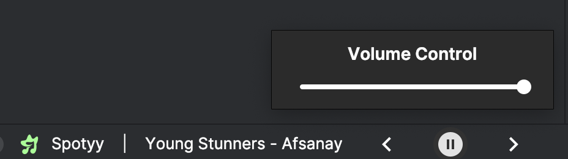

# 🎵 Spotyy - Spotify Controls for IntelliJ


<p align="center">
  <b>Control Spotify without leaving your IDE</b>
</p>

<p align="center">
  <a href="#features">Features</a> •
  <a href="#installation">Installation</a> •
  <a href="#usage">Usage</a> •
  <a href="#development">Development</a> •
  <a href="#license">License</a>
</p>

<p align="center">
  
  
  
</p>

## 🚀 Features

Spotyy is an IntelliJ IDEA plugin that lets you control Spotify directly from your IDE status bar:

- ▶️ Play/pause your music with one click
- ⏮️ Skip to previous track
- ⏭️ Skip to next track
- 🔊 Control volume
- 📋 View currently playing track

## 📸 Demo

<p align="center">
  
</p>

<p align="center">
  
</p>

## 💿 Installation

1. Open IntelliJ IDEA
2. Go to `Preferences (Settings)` > `Plugins` > `Marketplace`
3. Search for "**Spotyy**"
4. Click `Install`
5. Restart IntelliJ IDEA

## 📝 Requirements

- macOS (currently only supports macOS)
- Spotify desktop application installed
- IntelliJ IDEA or other JetBrains IDE

## 🎮 Usage

After installation, you'll see a Spotify icon in your status bar at the bottom of the IDE.

- **Click** on the icon to expand the player controls
- **Left-click** on the play/pause button to toggle playback
- Use the **volume slider** to adjust volume

## ⚙️ Configuration

No additional configuration is required. The plugin automatically detects your Spotify installation and connects to it
through AppleScript.

## 🔧 Development

### Prerequisites

- Java 11 or higher
- Gradle
- IntelliJ IDEA

### Building from source

```bash
# Clone the repository
git clone https://github.com/magneto3572/Spotyy.git

# Navigate to the project directory
cd Spotyy

# Build the plugin
./gradlew buildPlugin
```

The built plugin will be available in `build/distributions/`.

## 🤝 Contributing

Contributions are welcome! Feel free to open issues or submit pull requests.

## 📜 License

This project is licensed under the MIT License - see the LICENSE file for details.

## 🙏 Acknowledgements

- Spotify for their amazing music service
- JetBrains for the IntelliJ Platform SDK
- All contributors and users of this plugin

---

<p align="center">Made with ❤️ for developers who love music</p>
