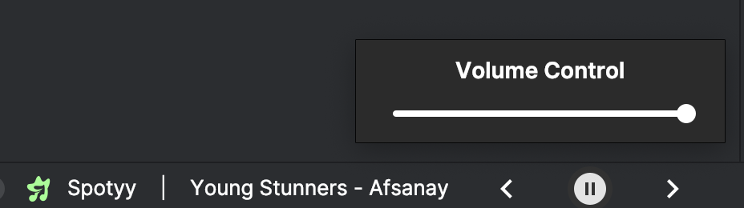

# 🎵 Spotyy - Spotify Controls for JetBrains IDEs


<p align="center">
  <b>Control Spotify without leaving your IDE</b>
</p>

<p align="center">
  <a href="#features">Features</a> •
  <a href="#installation">Installation</a> •
  <a href="#usage">Usage</a> •
  <a href="#development">Development</a> •
  <a href="#license">License</a>
</p>

<p align="center">
  
  
  
  
  
  
  
</p>

## 🚀 Features

>
> Spotyy is a plugin for all JetBrains IDEs (IntelliJ IDEA, Android Studio, PyCharm, WebStorm, etc.) that lets you
> control Spotify directly from your IDE status bar:

- ▶️ Play/pause your music with one click
- ⏮️ Skip to previous track
- ⏭️ Skip to next track
- 🔊 Control volume
- 📋 View currently playing track

## 📸 Demo

<p align="center">
  
</p>

<p align="center">
  
</p>

## 💿 Installation

1. Open any JetBrains IDE (IntelliJ IDEA, Android Studio, PyCharm, etc.)
2. Go to `Preferences (Settings)` > `Plugins` > `Marketplace`
3. Search for "**Spotyy**"
4. Click `Install`
5. Restart your IDE

## 📝 Requirements

- **Cross-platform** - This plugin now runs on **macOS**, **Windows**, and **Linux**. It talks to your local Spotify
  client using each operating system's native control mechanism, so the same controls work everywhere.
- **Spotify desktop application** must be installed (not just the web player)
- Any JetBrains IDE (IntelliJ IDEA, Android Studio, PyCharm, WebStorm, etc.)

## 🖥️ Platform Support

Spotyy communicates with Spotify through the control mechanism that is native to each operating system. No extra setup
is required on any platform — the plugin detects the right integration automatically.

- **macOS** — Uses **AppleScript** to send commands to and read state from the Spotify desktop application.
- **Linux** — Uses the **MPRIS2** media-player interface over **D-Bus** to control playback and fetch the currently
  playing track.
- **Windows** — Uses the system **media controls** (System Media Transport Controls) to drive the Spotify desktop
  application.

## 🎮 Usage

After installation, you'll see a Spotify icon in your status bar at the bottom of the IDE.

- **Click** on the icon to expand the player controls
- **Left-click** on the play/pause button to toggle playback
- Use the **volume slider** to adjust volume

## ⚙️ Configuration

No additional configuration is required. The plugin automatically detects your Spotify installation and connects to it
through the appropriate platform integration — **AppleScript on macOS**, **MPRIS2 over D-Bus on Linux**, and the
**system media controls on Windows**.

## 🔧 Development

### Prerequisites

- Java 11 or higher
- Gradle
- IntelliJ IDEA

### Building from source

```bash
# Clone the repository
git clone https://github.com/magneto3572/Spotyy.git

# Navigate to the project directory
cd Spotyy

# Build the plugin
./gradlew buildPlugin
```

The built plugin will be available in `build/distributions/`.

## 🤝 Contributing

Contributions are welcome! Feel free to open issues or submit pull requests.

## 📜 License

This project is licensed under the MIT License - see the LICENSE file for details.

## 🙏 Acknowledgements

- Spotify for their amazing music service
- JetBrains for the IntelliJ Platform SDK

---

<p align="center">Made with ❤️ for developers who love music</p>
